```mermaid
graph TB
    subgraph "🖥️ Frontend Layer"
        A[React Components]
        B[Next.js Router]
        C[State Management]
    end
    
    subgraph "⚙️ Service Layer"
        D[Chat Service]
        E[Ollama Service]
        F[Config Service]
        G[Settings Service]
    end
    
    subgraph "🔌 External Services"
        H[Ollama Server]
        I[File System]
        J[Local Storage]
    end
    
    A --> D
    A --> F
    B --> A
    D --> E
    E --> H
    F --> I
    C --> J
    
    style A fill:#61dafb
    style H fill:#ff6b35
    style I fill:#4ade80
```

# 🚀 Web-AI

> **A sophisticated web interface for seamless AI model interaction through Ollama**

[](https://nextjs.org/)
[](https://www.typescriptlang.org/)
[](https://reactjs.org/)
[](https://tailwindcss.com/)
[](https://ollama.ai/)

**Transform your local AI experience** with this production-ready web application that provides a ChatGPT-like interface for interacting with local AI models through Ollama. Built with modern web technologies and designed for performance, privacy, and ease of use.

---

## ✨ Key Features

| Feature | Description |
|---------|-------------|
| 🤖 **Advanced Model Management** | Browse, install, and configure AI models with real-time progress tracking |
| 💬 **Intelligent Chat Interface** | ChatGPT-style chat UI with streaming responses and conversation history |
| 🧠 **Smart Context Awareness** | Understands references like "that", "it", maintaining conversation continuity |
| ⚙️ **Granular Configuration** | Fine-tune model parameters, API endpoints, and application behavior |
| 🎨 **Dynamic Theming** | Dark/light mode support with system preference detection |
| 📱 **Responsive Design** | Optimized for desktop, tablet, and mobile devices |
| 🔄 **Real-time Streaming** | Live streaming responses with progress indicators |
| 💾 **Persistent Storage** | Local conversation history and settings management |
| 🔒 **Privacy-First** | All data stays on your machine - no external API calls |
| 🎯 **Zero-Config Setup** | Works out of the box with sensible defaults |

---

## 🚀 Quick Start

### Prerequisites
- **Node.js** (v18 or higher)
- **npm** or **yarn**
- **Git**

### 1. Install Ollama

#### macOS
```bash
# Using Homebrew
brew install ollama

# Or using curl
curl -fsSL https://ollama.ai/install.sh | sh
```

#### Windows
Download from [ollama.ai](https://ollama.ai) and run the installer.

#### Linux
```bash
curl -fsSL https://ollama.ai/install.sh | sh
```

### 2. Start Ollama & Download Models

```bash
# Start Ollama service
ollama serve

# Download a model (in a new terminal)
ollama pull llama3.2:3b

# Verify installation
ollama list
```

### 3. Setup Web-AI

```bash
# Clone repository
git clone https://github.com/rudra-sah00/Web-AI.git
cd Web-AI

# Install dependencies
npm install

# Start development server
npm run dev
```

### 4. Open & Configure

1. Open `http://localhost:3000`
2. Go to **Settings** → **Models**
3. Select your downloaded model
4. Start chatting! 🎉

---

## 📁 Project Structure

```
Web-AI/
├── 📁 src/
│   ├── 📁 app/                 # Next.js App Router
│   │   ├── 📁 api/            # API endpoints
│   │   │   ├── 📁 chats/      # Chat management
│   │   │   ├── 📁 config/     # Configuration
│   │   │   └── 📁 settings/   # Settings management
│   │   ├── 📁 models/         # Model management page
│   │   ├── 📁 modules/        # Modules page  
│   │   └── 📁 settings/       # Settings page
│   ├── 📁 components/         # React components
│   │   ├── 📁 chat/          # Chat interface
│   │   ├── 📁 sidebar/       # Navigation sidebar
│   │   ├── 📁 theme/         # Theme management
│   │   └── 📁 ui/            # Base UI components
│   ├── 📁 services/          # Business logic
│   ├── 📁 lib/               # Utilities
│   └── 📁 config/            # Configuration
├── 📁 docs/                  # Documentation
│   ├── 📄 installation.md    # Setup guide
│   ├── 📄 architecture.md    # System architecture
│   └── 📄 api.md            # API documentation
├── 📄 package.json
└── 📄 README.md
```

---

## 🏗️ Architecture Overview



---

## 🛠️ Tech Stack

### Core Framework
- **[Next.js 15](https://nextjs.org/)** - Full-stack React framework with App Router
- **[TypeScript](https://www.typescriptlang.org/)** - Type-safe development
- **[React 19](https://reactjs.org/)** - User interface library

### Styling & UI
- **[Tailwind CSS](https://tailwindcss.com/)** - Utility-first CSS framework
- **[Shadcn/ui](https://ui.shadcn.com/)** - Modern component library
- **[Lucide React](https://lucide.dev/)** - Beautiful icon set
- **[Lottie React](https://www.npmjs.com/package/lottie-react)** - Smooth animations

### AI Integration
- **[Ollama](https://ollama.ai/)** - Local AI model runtime
- **Server-Sent Events** - Real-time streaming responses
- **Custom Context Engine** - Intelligent conversation continuity

### Development Tools
- **ESLint** - Code linting and quality
- **PostCSS** - CSS processing
- **Autoprefixer** - CSS vendor prefixes

---

## 📚 Documentation

| Document | Description |
|----------|-------------|
| **[📖 Installation Guide](./docs/installation.md)** | Comprehensive setup instructions |
| **[🏗️ Architecture Guide](./docs/architecture.md)** | System design and patterns |
| **[🔌 API Documentation](./docs/api.md)** | REST API reference |

---

## 🔧 Configuration

### Environment Variables
Create `.env.local`:
```env
# Ollama Configuration
OLLAMA_BASE_URL=http://localhost:11434

# Application Settings
NEXT_PUBLIC_APP_NAME=Web-AI
NEXT_PUBLIC_APP_VERSION=1.0.0
```

### Model Configuration
```json
{
  "defaultModel": "llama3.2:3b",
  "modelConfigs": {
    "llama3.2:3b": {
      "name": "Llama 3.2 3B",
      "parameters": {
        "temperature": 0.7,
        "top_p": 0.9,
        "max_tokens": 2048
      }
    }
  }
}
```

---

## 💡 Usage Examples

### Basic Chat
```typescript
// Start a conversation
const response = await ChatService.generateStreamingResponse(
  "Explain quantum computing",
  chatHistory,
  (chunk) => console.log(chunk)
);
```

### Smart Context
```typescript
// The AI understands references
User: "Write a Python function to calculate factorial"
AI: [provides factorial function]

User: "Now write that in Java"
AI: [converts the factorial function to Java]

User: "Add error handling to it"
AI: [adds error handling to the Java version]
```

### Model Management
```typescript
// Get available models
const models = await OllamaService.getAvailableModels();

// Install a new model
await OllamaService.pullModel("llama3.1:8b", onProgress);
```

---

## 🎯 Key Capabilities

### 🧠 Intelligent Context Management
- **Conversation Memory**: Maintains chat history for better responses
- **Smart References**: Understands "that", "it", "this" from previous context
- **Adaptive Prompting**: Adjusts based on conversation type (coding, Q&A, etc.)

### 🔄 Real-time Streaming
- **Live Responses**: See AI responses as they're generated
- **Progress Indicators**: Visual feedback during generation
- **Error Recovery**: Graceful handling of connection issues

### 🎨 Modern Interface
- **ChatGPT-style UI**: Familiar and intuitive design
- **Dark/Light Themes**: Automatic system preference detection
- **Responsive Layout**: Works on all device sizes
- **Smooth Animations**: Lottie-powered micro-interactions

---

## 🤝 Contributing

We welcome contributions! Please see our contributing guidelines:

1. **Fork** the repository
2. **Create** a feature branch (`git checkout -b feature/AmazingFeature`)
3. **Commit** your changes (`git commit -m 'Add some AmazingFeature'`)
4. **Push** to the branch (`git push origin feature/AmazingFeature`)
5. **Open** a Pull Request

---

## 🛟 Support & Troubleshooting

### Common Issues

#### Ollama Connection Error
```bash
# Check if Ollama is running
ollama serve

# Verify accessibility
curl http://localhost:11434/api/tags
```

#### No Models Available
```bash
# Install a model
ollama pull llama3.2:3b

# List installed models
ollama list
```

#### Port Already in Use
```bash
# Use different port
npm run dev -- -p 3001
```

### Getting Help
- 📖 Check the [Installation Guide](./docs/installation.md)
- 🏗️ Review the [Architecture Guide](./docs/architecture.md)
- 🔌 Consult the [API Documentation](./docs/api.md)
- 🐛 [Open an Issue](https://github.com/rudra-sah00/Web-AI/issues)

---

## 📄 License

This project is licensed under the **MIT License** - see the [LICENSE](LICENSE) file for details.

---

## 🙏 Acknowledgments

- **[Ollama](https://ollama.ai/)** - For providing the local AI runtime
- **[Vercel](https://vercel.com/)** - For the excellent Next.js framework
- **[Shadcn](https://ui.shadcn.com/)** - For the beautiful component library
- **[Tailwind CSS](https://tailwindcss.com/)** - For the utility-first CSS framework

---

<div align="center">
  <p><strong>Built with ❤️ for the local AI community</strong></p>
  <p>
    <a href="https://github.com/rudra-sah00/Web-AI">⭐ Star this project</a> •
    <a href="https://github.com/rudra-sah00/Web-AI/issues">🐛 Report Bug</a> •
    <a href="https://github.com/rudra-sah00/Web-AI/issues">💡 Request Feature</a>
  </p>
</div>
Download from [ollama.ai](https://ollama.ai) and run the installer.

#### Linux
```bash
curl -fsSL https://ollama.ai/install.sh | sh
```

### 2. Start Ollama & Download Models

```bash
# Start Ollama service
ollama serve

# Download a model (in a new terminal)
ollama pull llama3.2:3b

# Verify installation
ollama list
```

### 3. Setup Web-AI

```bash
# Clone repository
git clone https://github.com/rudra-sah00/Web-AI.git
cd Web-AI

# Install dependencies
npm install

# Start development server
npm run dev
```

### 4. Open & Configure

1. Open `http://localhost:3000`
2. Go to **Settings** → **Models**
3. Select your downloaded model
4. Start chatting! 🎉

---

## 📁 Project Structure

```
Web-AI/
├── 📁 src/
│   ├── 📁 app/                 # Next.js App Router
│   │   ├── 📁 api/            # API endpoints
│   │   │   ├── 📁 chats/      # Chat management
│   │   │   ├── 📁 config/     # Configuration
│   │   │   └── 📁 settings/   # Settings management
│   │   ├── 📁 models/         # Model management page
│   │   ├── 📁 modules/        # Modules page  
│   │   └── 📁 settings/       # Settings page
│   ├── 📁 components/         # React components
│   │   ├── 📁 chat/          # Chat interface
│   │   ├── 📁 sidebar/       # Navigation sidebar
│   │   ├── 📁 theme/         # Theme management
│   │   └── 📁 ui/            # Base UI components
│   ├── 📁 services/          # Business logic
│   ├── 📁 lib/               # Utilities
│   └── 📁 config/            # Configuration
├── 📁 docs/                  # Documentation
│   ├── 📄 installation.md    # Setup guide
│   ├── 📄 architecture.md    # System architecture
│   └── 📄 api.md            # API documentation
├── 📄 package.json
└── 📄 README.md
```

---

## 🏗️ Architecture Overview


---

## 🛠️ Tech Stack

### Core Framework
- **[Next.js 15](https://nextjs.org/)** - Full-stack React framework with App Router
- **[TypeScript](https://www.typescriptlang.org/)** - Type-safe development
- **[React 19](https://reactjs.org/)** - User interface library

### Styling & UI
- **[Tailwind CSS](https://tailwindcss.com/)** - Utility-first CSS framework
- **[Shadcn/ui](https://ui.shadcn.com/)** - Modern component library
- **[Lucide React](https://lucide.dev/)** - Beautiful icon set
- **[Lottie React](https://www.npmjs.com/package/lottie-react)** - Smooth animations

### AI Integration
- **[Ollama](https://ollama.ai/)** - Local AI model runtime
- **Server-Sent Events** - Real-time streaming responses
- **Custom Context Engine** - Intelligent conversation continuity

### Development Tools
- **ESLint** - Code linting and quality
- **PostCSS** - CSS processing
- **Autoprefixer** - CSS vendor prefixes

---

## 📚 Documentation

| Document | Description |
|----------|-------------|
| **[📖 Installation Guide](./docs/installation.md)** | Comprehensive setup instructions |
| **[🏗️ Architecture Guide](./docs/architecture.md)** | System design and patterns |
| **[🔌 API Documentation](./docs/api.md)** | REST API reference |

---

## 🔧 Configuration

### Environment Variables
Create `.env.local`:
```env
# Ollama Configuration
OLLAMA_BASE_URL=http://localhost:11434

# Application Settings
NEXT_PUBLIC_APP_NAME=Web-AI
NEXT_PUBLIC_APP_VERSION=1.0.0
```

### Model Configuration
```json
{
  "defaultModel": "llama3.2:3b",
  "modelConfigs": {
    "llama3.2:3b": {
      "name": "Llama 3.2 3B",
      "parameters": {
        "temperature": 0.7,
        "top_p": 0.9,
        "max_tokens": 2048
      }
    }
  }
}
```

---

## 💡 Usage Examples

### Basic Chat
```typescript
// Start a conversation
const response = await ChatService.generateStreamingResponse(
  "Explain quantum computing",
  chatHistory,
  (chunk) => console.log(chunk)
);
```

### Smart Context
```typescript
// The AI understands references
User: "Write a Python function to calculate factorial"
AI: [provides factorial function]

User: "Now write that in Java"
AI: [converts the factorial function to Java]

User: "Add error handling to it"
AI: [adds error handling to the Java version]
```

### Model Management
```typescript
// Get available models
const models = await OllamaService.getAvailableModels();

// Install a new model
await OllamaService.pullModel("llama3.1:8b", onProgress);
```

---

## 🎯 Key Capabilities

### 🧠 Intelligent Context Management
- **Conversation Memory**: Maintains chat history for better responses
- **Smart References**: Understands "that", "it", "this" from previous context
- **Adaptive Prompting**: Adjusts based on conversation type (coding, Q&A, etc.)

### 🔄 Real-time Streaming
- **Live Responses**: See AI responses as they're generated
- **Progress Indicators**: Visual feedback during generation
- **Error Recovery**: Graceful handling of connection issues

### 🎨 Modern Interface
- **ChatGPT-style UI**: Familiar and intuitive design
- **Dark/Light Themes**: Automatic system preference detection
- **Responsive Layout**: Works on all device sizes
- **Smooth Animations**: Lottie-powered micro-interactions

---

## 🤝 Contributing

We welcome contributions! Please see our contributing guidelines:

1. **Fork** the repository
2. **Create** a feature branch (`git checkout -b feature/AmazingFeature`)
3. **Commit** your changes (`git commit -m 'Add some AmazingFeature'`)
4. **Push** to the branch (`git push origin feature/AmazingFeature`)
5. **Open** a Pull Request

---

## 🛟 Support & Troubleshooting

### Common Issues

#### Ollama Connection Error
```bash
# Check if Ollama is running
ollama serve

# Verify accessibility
curl http://localhost:11434/api/tags
```

#### No Models Available
```bash
# Install a model
ollama pull llama3.2:3b

# List installed models
ollama list
```

#### Port Already in Use
```bash
# Use different port
npm run dev -- -p 3001
```

### Getting Help
- 📖 Check the [Installation Guide](./docs/installation.md)
- 🏗️ Review the [Architecture Guide](./docs/architecture.md)
- 🔌 Consult the [API Documentation](./docs/api.md)
- 🐛 [Open an Issue](https://github.com/rudra-sah00/Web-AI/issues)

---

## 📄 License

This project is licensed under the **MIT License** - see the [LICENSE](LICENSE) file for details.

---

## 🙏 Acknowledgments

- **[Ollama](https://ollama.ai/)** - For providing the local AI runtime
- **[Vercel](https://vercel.com/)** - For the excellent Next.js framework
- **[Shadcn](https://ui.shadcn.com/)** - For the beautiful component library
- **[Tailwind CSS](https://tailwindcss.com/)** - For the utility-first CSS framework

---

<div align="center">
  <p><strong>Built with ❤️ for the local AI community</strong></p>
  <p>
    <a href="https://github.com/rudra-sah00/Web-AI">⭐ Star this project</a> •
    <a href="https://github.com/rudra-sah00/Web-AI/issues">🐛 Report Bug</a> •
    <a href="https://github.com/rudra-sah00/Web-AI/issues">💡 Request Feature</a>
  </p>
</div>

---

## 🌟 Key Features

<table>
  <tr>
    <td>🤖 <strong>Advanced Model Management</strong></td>
    <td>Browse, install, and configure AI models with real-time progress tracking</td>
  </tr>
  <tr>
    <td>💬 <strong>Intelligent Chat Interface</strong></td>
    <td>Modern, responsive chat UI with streaming responses and conversation history</td>
  </tr>
  <tr>
    <td>⚙️ <strong>Granular Configuration</strong></td>
    <td>Fine-tune model parameters, API endpoints, and application behavior</td>
  </tr>
  <tr>
    <td>🎨 <strong>Dynamic Theming</strong></td>
    <td>Dark/light mode support with system preference detection</td>
  </tr>
  <tr>
    <td>📱 <strong>Responsive Design</strong></td>
    <td>Optimized for desktop, tablet, and mobile devices</td>
  </tr>
  <tr>
    <td>🔄 <strong>Real-time Updates</strong></td>
    <td>Live streaming responses with progress indicators and error handling</td>
  </tr>
  <tr>
    <td>� <strong>Persistent Storage</strong></td>
    <td>Local chat history and configuration management</td>
  </tr>
  <tr>
    <td>🛡️ <strong>Type Safety</strong></td>
    <td>Full TypeScript implementation with comprehensive error handling</td>
  </tr>
</table>

## 🏗️ Technical Architecture

### Core Technologies
- **Frontend Framework**: Next.js 15.3.1 (App Router)
- **Language**: TypeScript 5.0 with strict type checking
- **UI Framework**: React 19.0 with modern hooks
- **Styling**: TailwindCSS 4.0 + shadcn/ui components
- **State Management**: React Context + Custom hooks
- **API Integration**: RESTful APIs with streaming support
- **Build Tool**: Turbopack for ultra-fast development

### Component Architecture
```
📦 Modular Component Structure
├── 🎯 AppLayout (Main application shell)
├── 💬 ChatModule (Core chat functionality)
├── 🎛️ SettingsDialog (Configuration management)
├── 📱 Sidebar (Navigation & chat history)
├── 🎨 ThemeProvider (Dark/light mode)
└── 🧩 UI Components (Reusable design system)
```

### Service Layer
- **OllamaService**: Direct API communication with Ollama
- **ChatService**: Chat session management and persistence
- **ConfigService**: Application configuration handling
- **ModelParameterService**: Model configuration management

## 🚀 Quick Start

### Prerequisites
- **Node.js**: v18.0+ ([Download](https://nodejs.org/))
- **Package Manager**: npm, yarn, or bun
- **Ollama**: Latest version ([Download](https://ollama.ai/download))

### Installation & Setup

```bash
# 1. Clone the repository
git clone https://github.com/rudra-sah00/Web-AI.git
cd Web-AI

# 2. Install dependencies
npm install
# or using yarn
yarn install
# or using bun
bun install

# 3. Start Ollama service (in separate terminal)
ollama serve

# 4. Run development server
npm run dev
# or
yarn dev
# or
bun dev

# 5. Open your browser
# Navigate to http://localhost:3000
```

### Production Deployment

```bash
# Build optimized production bundle
npm run build

# Start production server
npm run start
```

## 🎯 Project Highlights

### 1. **Modern Next.js Implementation**
- **App Router**: Utilizing Next.js 15's latest routing paradigm
- **Server Components**: Optimized rendering with React Server Components
- **Turbopack**: Lightning-fast development with next-generation bundling
- **API Routes**: RESTful endpoints for chat management and configuration

### 2. **Advanced TypeScript Architecture**
```typescript
// Type-safe service layer with comprehensive interfaces
interface OllamaModel {
  id: string;
  name: string;
  description: string;
  parameters: ModelParameters;
  installed: boolean;
}

interface ChatMessage {
  id: string;
  content: string;
  role: 'user' | 'assistant';
  timestamp: Date;
  model?: string;
}
```

### 3. **Sophisticated UI/UX Design**
- **shadcn/ui**: Professional component library implementation
- **Radix UI**: Accessible, unstyled component primitives
- **Framer Motion**: Smooth animations and transitions
- **Responsive Design**: Mobile-first approach with TailwindCSS
- **Theme System**: Dynamic dark/light mode with system preference detection

### 4. **Real-time Features**
- **Streaming Responses**: Live AI response generation with progress indicators
- **WebSocket-like Experience**: Seamless real-time communication
- **Progress Tracking**: Model installation and download progress
- **Error Handling**: Comprehensive error boundaries and user feedback

### 5. **State Management & Performance**
- **Custom Hooks**: Reusable logic with `useOllamaModels`, `useModelSearch`
- **Context API**: Global state management for themes and configuration
- **Memoization**: Optimized re-rendering with React.memo and useMemo
- **Lazy Loading**: Code splitting for optimal bundle sizes

## 📁 Project Structure

```
Web-AI/
├── 📂 src/
│   ├── 📂 app/                 # Next.js App Router
│   │   ├── 📄 layout.tsx       # Root layout with providers
│   │   ├── 📄 page.tsx         # Main application page
│   │   └── 📂 api/             # API routes
│   │       ├── 📂 chats/       # Chat management endpoints
│   │       └── 📂 config/      # Configuration endpoints
│   ├── 📂 components/
│   │   ├── 📂 chat/            # Chat interface components
│   │   │   ├── 📄 ChatModule.tsx
│   │   │   ├── 📄 ChatHeader.tsx
│   │   │   ├── 📄 MessageInput.tsx
│   │   │   └── 📄 MessageItem.tsx
│   │   ├── 📂 setting/         # Settings components
│   │   ├── 📂 sidebar/         # Navigation components
│   │   ├── 📂 theme/           # Theme system
│   │   └── 📂 ui/              # Reusable UI components
│   ├── 📂 services/            # Business logic layer
│   │   ├── 📄 OllamaService.ts # Ollama API integration
│   │   ├── 📄 ChatService.ts   # Chat management
│   │   └── 📄 ConfigService.ts # Configuration handling
│   └── 📂 lib/                 # Utilities and helpers
├── 📂 data/                    # Application data
│   ├── 📄 runtime-config.json  # Runtime configuration
│   └── 📂 chats/               # Stored conversations
└── 📄 components.json          # shadcn/ui configuration
```

## 🛠️ Technical Implementation Details

### API Integration
```typescript
class OllamaService {
  private apiUrl: string;
  private modelInstallProgress: Map<string, ProgressData>;
  
  async streamGeneration(prompt: string, model: string): Promise<ReadableStream> {
    // Implementation of streaming responses with error handling
  }
  
  async pullModel(modelName: string, onProgress: ProgressCallback): Promise<void> {
    // Real-time model installation with progress tracking
  }
}
```

### Component Architecture
- **Compound Components**: Flexible, composable UI patterns
- **Render Props**: Dynamic component composition
- **Custom Hooks**: Reusable stateful logic
- **Higher-Order Components**: Cross-cutting concerns

### State Management Pattern
```typescript
// Custom hook for Ollama models
const useOllamaModels = () => {
  const [models, setModels] = useState<OllamaModel[]>([]);
  const [loading, setLoading] = useState(false);
  const [error, setError] = useState<string | null>(null);
  
  // Comprehensive state management with error boundaries
};
```

## 📊 Features Showcase

### 1. **Dynamic Model Management**
- Real-time model discovery and installation
- Progress tracking with visual indicators
- Model parameter fine-tuning interface
- Automatic model updates and health checks

### 2. **Advanced Chat Interface**
- Stream-based response rendering
- Message history with search and filtering
- Conversation branching and management
- Prompt template system for common use cases

### 3. **Configuration Management**
- Runtime configuration updates
- API endpoint management
- Model parameter presets
- Export/import settings functionality

### 4. **Performance Optimizations**
- Code splitting with dynamic imports
- Image optimization with Next.js Image component
- Bundle analysis and size optimization
- Efficient re-rendering with React.memo

## 🔧 Configuration & Customization

### Environment Variables
```bash
# .env.local
NEXT_PUBLIC_OLLAMA_API_URL=http://localhost:11434
NEXT_PUBLIC_APP_NAME=Ollama Web AI
NEXT_PUBLIC_MAX_CHAT_HISTORY=100
```

### Model Configuration
```json
{
  "ollamaModels": [
    {
      "id": "qwen:0.5b",
      "name": "Qwen 2.5 (0.5B)",
      "description": "Efficient small language model",
      "parameters": {
        "temperature": 0.9,
        "top_p": 0.5,
        "max_tokens": 4070
      }
    }
  ]
}
```

## 🚀 Development Workflow

### Code Quality & Standards
- **ESLint**: Strict linting with Next.js recommended rules
- **TypeScript**: Full type coverage with strict mode
- **Prettier**: Consistent code formatting
- **Husky**: Pre-commit hooks for quality assurance

### Testing Strategy
- **Unit Tests**: Component testing with Jest & React Testing Library
- **Integration Tests**: API route testing
- **E2E Tests**: User journey validation with Playwright
- **Type Safety**: Comprehensive TypeScript coverage

### Performance Monitoring
- **Lighthouse**: Performance, accessibility, and SEO optimization
- **Bundle Analyzer**: Code splitting optimization
- **Core Web Vitals**: Real user metrics tracking

## 🌐 Deployment Options

### Vercel (Recommended)
```bash
# One-click deployment
npx vercel

# Or connect your GitHub repository for automatic deployments
```

### Docker Deployment
```dockerfile
FROM node:18-alpine
WORKDIR /app
COPY package*.json ./
RUN npm ci --only=production
COPY . .
RUN npm run build
EXPOSE 3000
CMD ["npm", "start"]
```

### Self-hosted
```bash
# Production build
npm run build

# Start with PM2
pm2 start npm --name "ollama-web-ai" -- start
```

## 🤝 Contributing

We welcome contributions! Please see our [Contributing Guidelines](CONTRIBUTING.md) for details.

### Development Setup
```bash
# Fork the repository
git clone https://github.com/your-username/Web-AI.git

# Create feature branch
git checkout -b feature/amazing-feature

# Make your changes and commit
git commit -m "Add amazing feature"

# Push to your fork and create PR
git push origin feature/amazing-feature
```

## 📈 Roadmap

- [ ] **Multi-language Support** - Internationalization (i18n)
- [ ] **Plugin System** - Extensible architecture for custom integrations
- [ ] **Advanced Analytics** - Usage statistics and performance metrics
- [ ] **Team Collaboration** - Shared workspaces and chat rooms
- [ ] **API Documentation** - Interactive OpenAPI documentation
- [ ] **Mobile App** - React Native companion application

## 🏆 Technical Skills Demonstrated

<div align="center">
  <table>
    <tr>
      <th>Category</th>
      <th>Technologies</th>
      <th>Implementation</th>
    </tr>
    <tr>
      <td><strong>Frontend</strong></td>
      <td>React 19, Next.js 15, TypeScript</td>
      <td>Modern React patterns, Server Components, App Router</td>
    </tr>
    <tr>
      <td><strong>Styling</strong></td>
      <td>TailwindCSS, shadcn/ui, Framer Motion</td>
      <td>Design system, responsive design, animations</td>
    </tr>
    <tr>
      <td><strong>State Management</strong></td>
      <td>Context API, Custom Hooks</td>
      <td>Global state, local state optimization</td>
    </tr>
    <tr>
      <td><strong>API Integration</strong></td>
      <td>REST APIs, Streaming, WebSockets</td>
      <td>Real-time communication, error handling</td>
    </tr>
    <tr>
      <td><strong>Performance</strong></td>
      <td>Code Splitting, Lazy Loading, Memoization</td>
      <td>Bundle optimization, render optimization</td>
    </tr>
    <tr>
      <td><strong>Developer Experience</strong></td>
      <td>TypeScript, ESLint, Hot Reload</td>
      <td>Type safety, code quality, fast development</td>
    </tr>
  </table>
</div>

## 📞 Contact & Support

<div align="center">
  <p>
    <strong>Developed with ❤️ by Rudra Sah</strong>
  </p>
  
  <p>
    <a href="https://github.com/rudra-sah00">
      
    </a>
    <a href="mailto:your.email@example.com">
      
    </a>
    <a href="https://linkedin.com/in/rudra-sah">
      
    </a>
  </p>
</div>

---

<div align="center">
  <p><strong>⭐ Star this repository if you find it helpful!</strong></p>
  <p><em>This project showcases modern web development practices and is actively maintained.</em></p>
</div>
