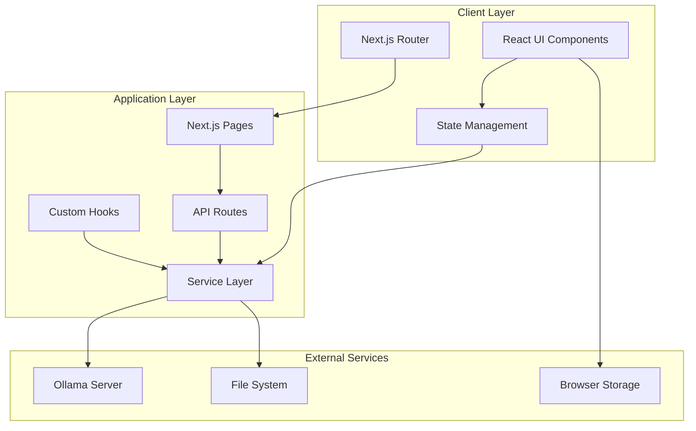
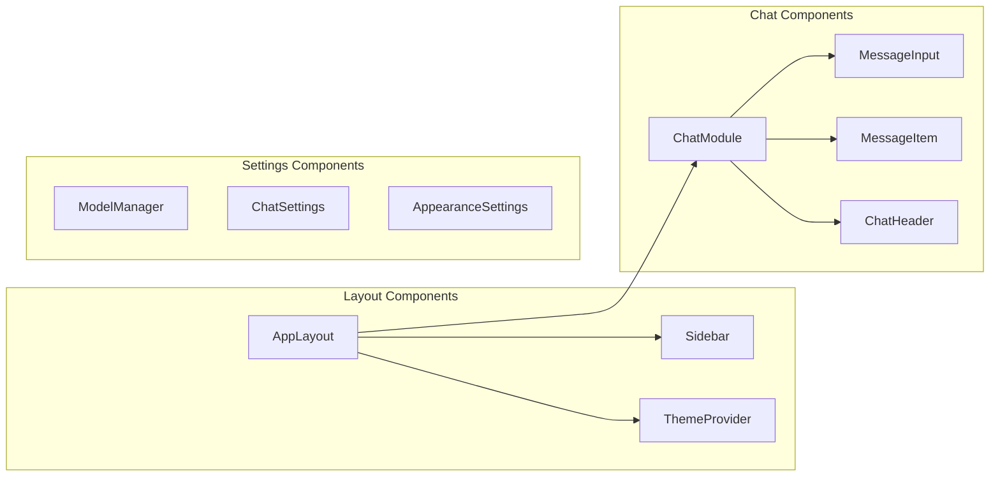
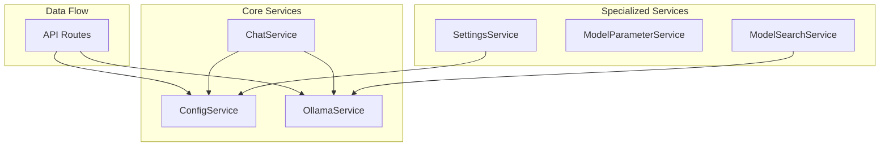
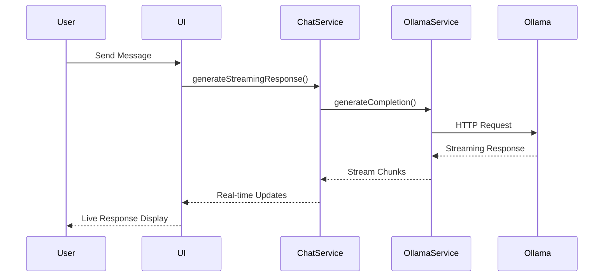

# Architecture Guide

## System Overview

Web-AI is a modern, modular Next.js application that provides a ChatGPT-like interface for interacting with local AI models through Ollama. The architecture emphasizes real-time communication, intelligent context management, and a responsive user experience.

## Architecture Diagram



## Component Architecture



## Service Layer Architecture



## Data Flow Architecture



## Key Architectural Patterns

### 1. Service-Oriented Architecture (SOA)
- **Separation of Concerns**: Each service handles specific functionality
- **Reusability**: Services can be used across multiple components
- **Testability**: Individual services can be unit tested independently

### 2. Real-time Streaming
- **Streaming API**: Server-Sent Events for real-time AI responses
- **Progressive Enhancement**: UI updates as data streams in
- **Error Handling**: Graceful fallbacks for connection issues

### 3. Context-Aware Intelligence
- **Conversation Memory**: Maintains chat history for context
- **Smart References**: Understands pronouns and implicit references
- **Adaptive Prompting**: Adjusts prompts based on conversation type

### 4. Modular Component Design
- **Composition**: Components built through composition patterns
- **Props Interface**: Clear data flow through props
- **Custom Hooks**: Reusable stateful logic

## Directory Structure

```
src/
├── app/                    # Next.js App Router
│   ├── api/               # API Routes
│   │   ├── chats/        # Chat management endpoints
│   │   ├── config/       # Configuration endpoints
│   │   └── settings/     # Settings endpoints
│   ├── models/           # Model management page
│   ├── modules/          # Modules page
│   └── settings/         # Settings page
├── components/            # Reusable UI components
│   ├── chat/             # Chat-related components
│   ├── sidebar/          # Sidebar components
│   ├── theme/            # Theme management
│   └── ui/               # Base UI components
├── services/             # Business logic layer
├── lib/                  # Utility functions
└── config/               # Configuration files
```

## Core Technologies

### Frontend Stack
- **Next.js 15**: React framework with App Router
- **TypeScript**: Type-safe development
- **Tailwind CSS**: Utility-first styling
- **Shadcn/ui**: Component library
- **Lottie React**: Animations

### Backend Integration
- **Ollama**: Local AI model server
- **Server-Sent Events**: Real-time streaming
- **File System**: Local data persistence
- **REST API**: Standard HTTP endpoints

## Performance Optimizations

### 1. Streaming Responses
```typescript
// Real-time response streaming
async function* streamResponse() {
  const response = await fetch('/api/generate', { stream: true });
  const reader = response.body?.getReader();
  
  while (true) {
    const { done, value } = await reader.read();
    if (done) break;
    yield new TextDecoder().decode(value);
  }
}
```

### 2. Context Optimization
- **Context Limiting**: Uses last 15 messages for optimal performance
- **Smart Batching**: Groups related context for better inference
- **Memory Management**: Efficient message storage and retrieval

### 3. Component Optimization
- **React.memo**: Prevents unnecessary re-renders
- **useMemo/useCallback**: Memoizes expensive computations
- **Lazy Loading**: Components loaded on demand

## Security Considerations

### 1. Local-First Architecture
- **No External APIs**: All processing happens locally
- **Data Privacy**: Conversations never leave your machine
- **Offline Capability**: Works without internet connection

### 2. Input Validation
- **Sanitization**: User inputs are sanitized before processing
- **Type Safety**: TypeScript prevents type-related vulnerabilities
- **Error Boundaries**: Graceful error handling

### 3. Configuration Security
- **Environment Variables**: Sensitive data in environment files
- **Local Storage**: Settings stored securely in browser
- **No Plain Text Secrets**: Configuration uses secure patterns

## Scalability Features

### 1. Modular Design
- **Component Isolation**: Easy to add/remove features
- **Service Abstraction**: Can swap underlying AI providers
- **Plugin Architecture**: Extensible through services

### 2. Performance Monitoring
- **Error Tracking**: Comprehensive error logging
- **Performance Metrics**: Response time monitoring
- **Resource Usage**: Memory and CPU tracking

### 3. Configuration Management
- **Dynamic Settings**: Runtime configuration changes
- **Model Switching**: Hot-swap AI models
- **Theme Customization**: Real-time appearance updates

## Development Patterns

### 1. Component Patterns
```typescript
// Composition pattern
interface ComponentProps {
  children: React.ReactNode;
  className?: string;
}

// Custom hook pattern
function useOllamaModels() {
  const [models, setModels] = useState([]);
  // ... logic
  return { models, loading, error };
}
```

### 2. Service Patterns
```typescript
// Singleton service pattern
class ConfigService {
  private static instance: ConfigService;
  
  static getInstance(): ConfigService {
    if (!ConfigService.instance) {
      ConfigService.instance = new ConfigService();
    }
    return ConfigService.instance;
  }
}
```

### 3. Error Handling Patterns
```typescript
// Graceful error handling
try {
  const response = await service.call();
  return response;
} catch (error) {
  console.error('Service error:', error);
  return fallbackResponse;
}
```

This architecture ensures a maintainable, scalable, and performant application that provides an excellent user experience while maintaining data privacy and security.
